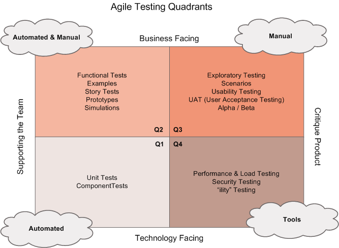

# Configure Automated Integration and Functional Test Automation

## Overview
This document provides a summary of configuring automated integration and functional test automation, focusing on Continuous Delivery and Agile Testing principles.

## Key Concepts

### 1. Continuous Delivery and Automation
- Automation is critical for frequent deployments.
- Manual tests are inefficient for Continuous Delivery.

### 2. Agile Testing Quadrants
#### Quadrant 1 (Business Facing, Supporting the Team)
- Functional tests, story tests, prototypes, and simulations.
- Supports the team in delivering correct functionality.

#### Quadrant 2 (Technology Facing, Supporting the Team)
- Unit tests, component tests, system/integration tests.
- Provides constant feedback to developers.

#### Quadrant 3 (Business Facing, Critique Product)
- Exploratory, usability, and acceptance tests.
- Hardest to automate; executed earlier in the development cycle.

#### Quadrant 4 (Technology Facing, Critique Product)
- Performance, load, security, and non-functional tests.
- Automated by nature.

### 3. Shift-Left Testing
- Move testing earlier in the development cycle.
- Automate as many tests as possible.

### 4. Principles for Test Automation
- Write tests at the lowest level possible.
- Write once, run anywhere (including production).
- Design the product for testability.
- Treat test code as product code.
- Test ownership follows product ownership.

### 5. Test Execution in Pipelines
- Use pipelines to execute tests requiring deployed apps or infrastructure.
- Integrate external tools (e.g., Owasp ZAP, SpecFlow, Selenium).
- Use cloud platforms (e.g., Azure) for availability or load tests.

### 6. Choosing Test Languages
- Use the same language as the application code.
- Example: Write .NET tests for .NET apps, Angular tests for Angular apps.

### 7. Test Agents
- Required for UI or specialized functionality tests.
- Install test agents before or during pipeline execution.

## Summary
- Automate tests to support Continuous Delivery.
- Use Agile Testing Quadrants to categorize and prioritize tests.
- Shift-left testing to catch issues earlier in the development cycle.
- Integrate test automation into pipelines for efficient execution.

