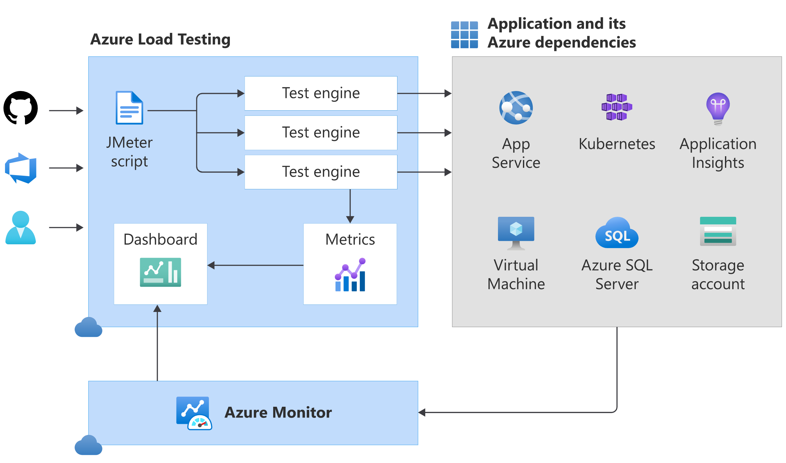

# Explore Azure Load Testing

## Overview
This document provides an overview of Azure Load Testing, a fully managed service for simulating high-scale traffic to optimize application performance.

## Key Concepts

### 1. Azure Load Testing Overview
- Fully managed load-testing service.
- Simulates high-scale traffic to optimize application performance, scalability, and capacity.

### 2. Key Features
- Supports Apache JMeter-based test scripts.
- Abstracts infrastructure for running JMeter scripts.
- Collects detailed resource metrics for Azure-based applications.
- Identifies performance bottlenecks across Azure application components.

### 3. Integration with CI/CD
- Automates regression testing by integrating load tests into CI/CD workflows.
- Can be triggered from Azure Pipelines or GitHub Actions.

### 4. Use Cases
- Run load tests at the end of each sprint or in staging environments.
- Validate release candidate builds before deployment.

### 5. Supported Tools
- Azure Pipelines.
- GitHub Actions (via Azure Load Testing GitHub action).

### 6. Metrics Collection
- Uses Azure Monitor to capture metrics for application components.
- Provides insights into supported Azure resource types.

## Summary
- Azure Load Testing is a powerful tool for optimizing application performance and scalability.
- Integrates seamlessly with CI/CD workflows for automated regression testing.
- Provides detailed metrics to identify and resolve performance bottlenecks.

